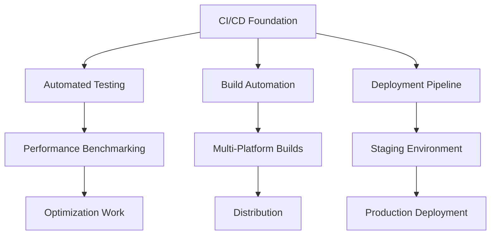
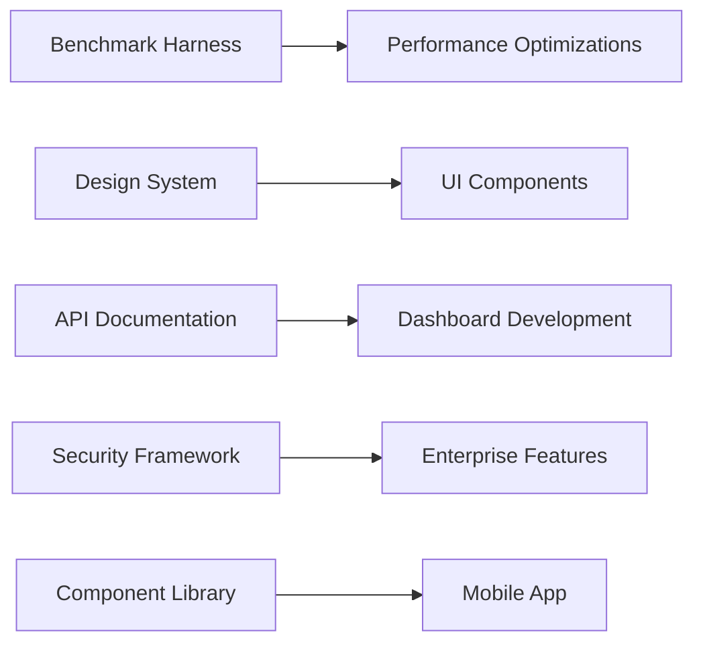

# Resource Allocation & Dependency Mapping
## Strategic Team Structure and Project Coordination for Inferno Platform

This document outlines the comprehensive resource allocation strategy, team scaling plan, dependency management, and budget allocation across all development tracks.

---

## Executive Summary

**Total Investment**: $3.7M over 18 months
**Peak Team Size**: 45 FTE across 5 specialized tracks
**Resource Allocation**: 40% Engineering, 25% UI/UX, 20% DevOps/QA, 15% Documentation/Community

---

## Phase-by-Phase Resource Scaling

### Phase 1: Foundation (Months 1-4) - 15 FTE
**Budget**: $925K | **Focus**: Critical infrastructure and quick wins

#### Team Composition
| Role | Count | Monthly Cost | Total Cost | Primary Track |
|------|--------|--------------|------------|---------------|
| **Senior Backend Engineers** | 5 | $25K | $500K | Performance/ML |
| **Frontend Engineers** | 4 | $20K | $320K | UI/Dashboard |
| **DevOps Engineers** | 3 | $22K | $264K | CI/CD |
| **QA Engineers** | 2 | $18K | $144K | Quality Assurance |
| **Product Manager** | 1 | $20K | $80K | Coordination |
| **Total Phase 1** | **15** | **$105K** | **$925K** | **All Tracks** |

### Phase 2: Scaling (Months 5-8) - 25 FTE (+10)
**Budget**: $1.2M | **Focus**: Advanced features and differentiation

#### Additional Team Members
| Role | Count | Monthly Cost | Total Cost | Primary Track |
|------|--------|--------------|------------|---------------|
| **ML Engineers** | 6 | $28K | $672K | ML Optimization |
| **Technical Writers** | 2 | $15K | $120K | Documentation |
| **UX/UI Designers** | 2 | $18K | $144K | UI/Dashboard |
| **Phase 2 Addition** | **+10** | **+$61K** | **$936K** | **Expansion** |
| **Total Phase 2** | **25** | **$166K** | **$1.2M** | **All Tracks** |

### Phase 3: Leadership (Months 9-12) - 35 FTE (+10)
**Budget**: $1.0M | **Focus**: Market leadership and advanced capabilities

#### Additional Team Members
| Role | Count | Monthly Cost | Total Cost | Primary Track |
|------|--------|--------------|------------|---------------|
| **Enterprise Engineers** | 5 | $26K | $520K | All Tracks |
| **Developer Relations** | 3 | $20K | $240K | Documentation |
| **Security Engineers** | 2 | $25K | $200K | CI/CD |
| **Phase 3 Addition** | **+10** | **+$71K** | **$960K** | **Leadership** |
| **Total Phase 3** | **35** | **$237K** | **$1.0M** | **All Tracks** |

### Phase 4: Excellence (Months 13-18) - 45 FTE (+10)
**Budget**: $555K | **Focus**: Global expansion and next-generation features

#### Additional Team Members
| Role | Count | Monthly Cost | Total Cost | Primary Track |
|------|--------|--------------|------------|---------------|
| **Research Engineers** | 5 | $30K | $900K | Future Tech |
| **International Specialists** | 3 | $18K | $324K | Localization |
| **Sustainability Engineers** | 2 | $22K | $264K | Green AI |
| **Phase 4 Addition** | **+10** | **+$70K** | **$1.488M** | **Innovation** |
| **Total Phase 4** | **45** | **$307K** | **$555K** | **Excellence** |

---

## Detailed Role Specifications & Skill Requirements

### Performance & ML Optimization Track (40% allocation)

#### Senior Backend Engineers (Rust/C++)
**Responsibilities**:
- SIMD optimization and vectorization
- Memory management and cache optimization
- Async runtime performance tuning
- Backend trait implementations

**Required Skills**:
- Expert-level Rust (5+ years)
- Systems programming and performance optimization
- SIMD instructions (AVX, NEON, SSE)
- Memory profiling tools (Valgrind, Heaptrack)
- GPU programming (CUDA, OpenCL, Metal)

**Compensation**: $150K - $200K annually

#### ML Engineers (Python/Rust)
**Responsibilities**:
- Quantization algorithm implementation
- Model optimization and compression
- Hardware acceleration integration
- Performance benchmarking

**Required Skills**:
- Deep learning frameworks (PyTorch, ONNX)
- Model optimization techniques
- Quantization and pruning algorithms
- Hardware acceleration (TensorRT, CoreML)
- Performance analysis and profiling

**Compensation**: $160K - $220K annually

### UI/Dashboard Development Track (25% allocation)

#### Frontend Engineers (TypeScript/React)
**Responsibilities**:
- React component development
- Real-time dashboard implementation
- Mobile application development
- Performance optimization

**Required Skills**:
- Expert React/TypeScript (4+ years)
- Modern frontend tools (Next.js, Vite)
- Real-time web technologies (WebSocket, SSE)
- Mobile development (React Native)
- Data visualization (D3.js, Recharts)

**Compensation**: $120K - $160K annually

#### UX/UI Designers
**Responsibilities**:
- Design system creation
- User experience research
- Accessibility compliance
- Visual design and prototyping

**Required Skills**:
- Design tools (Figma, Sketch, Adobe Creative Suite)
- User research methodologies
- Accessibility standards (WCAG 2.1)
- Design systems and component libraries
- Prototyping and interaction design

**Compensation**: $100K - $140K annually

### CI/CD Pipeline Track (20% allocation)

#### DevOps Engineers
**Responsibilities**:
- CI/CD pipeline development
- Infrastructure automation
- Monitoring and observability
- Security integration

**Required Skills**:
- Infrastructure as Code (Terraform, Pulumi)
- Container orchestration (Kubernetes, Docker)
- CI/CD tools (GitHub Actions, Jenkins)
- Cloud platforms (AWS, Azure, GCP)
- Monitoring tools (Prometheus, Grafana)

**Compensation**: $130K - $170K annually

#### Security Engineers
**Responsibilities**:
- Security framework implementation
- Vulnerability assessment
- Compliance management
- Threat modeling

**Required Skills**:
- Security frameworks and standards
- Penetration testing and vulnerability assessment
- Compliance requirements (SOC2, HIPAA)
- Security tools (SAST, DAST, IAST)
- Cryptography and secure coding

**Compensation**: $140K - $180K annually

### Documentation & Tutorials Track (15% allocation)

#### Technical Writers
**Responsibilities**:
- API documentation
- Tutorial development
- Educational content creation
- Community management

**Required Skills**:
- Technical writing and documentation
- Developer education experience
- Content management systems
- Video production and editing
- Community engagement

**Compensation**: $80K - $120K annually

#### Developer Relations Engineers
**Responsibilities**:
- Community engagement
- Developer advocacy
- Conference speaking
- Partnership development

**Required Skills**:
- Developer community experience
- Public speaking and presentation
- Technical demonstration skills
- Partnership development
- Social media and content marketing

**Compensation**: $110K - $150K annually

---

## Critical Dependency Mapping

### Primary Dependencies (Blocking)

#### Infrastructure Dependencies


#### Development Track Dependencies


### Secondary Dependencies (Enabling)

#### Cross-Track Dependencies
| Dependent Feature | Blocking Feature | Track Dependency | Risk Level |
|-------------------|------------------|------------------|------------|
| **Real-time Dashboard** | WebSocket API | Backend → Frontend | Medium |
| **Mobile App** | Component Library | UI → Mobile | Low |
| **Performance Monitoring** | Metrics Collection | Performance → UI | Medium |
| **Advanced Optimizations** | Benchmark Suite | Performance → ML | High |
| **Documentation Portal** | API Framework | Backend → Docs | Low |
| **Certification Platform** | Learning Management | Docs → Platform | Medium |

### Dependency Risk Mitigation

#### High-Risk Dependencies
1. **Benchmark Suite → ML Optimizations**
   - **Risk**: ML optimization work blocked without performance measurement
   - **Mitigation**: Parallel development of basic benchmarking and simple optimizations
   - **Timeline Buffer**: 2 weeks

2. **API Framework → Dashboard Development**
   - **Risk**: Frontend development blocked without API contracts
   - **Mitigation**: API-first development with OpenAPI specifications
   - **Timeline Buffer**: 1 week

3. **Security Framework → Enterprise Features**
   - **Risk**: Enterprise deployment blocked without security
   - **Mitigation**: Basic security implementation in Phase 1, enhancement in Phase 2
   - **Timeline Buffer**: 3 weeks

#### Medium-Risk Dependencies
1. **Component Library → Advanced UI Features**
   - **Mitigation**: Incremental component development
   - **Timeline Buffer**: 1 week

2. **Performance Monitoring → Optimization Validation**
   - **Mitigation**: Basic monitoring first, advanced features later
   - **Timeline Buffer**: 2 weeks

---

## Budget Allocation by Category

### Personnel Costs (85% of budget)
| Category | Phase 1 | Phase 2 | Phase 3 | Phase 4 | Total |
|----------|---------|---------|---------|---------|-------|
| **Engineering** | $500K | $672K | $520K | $900K | $2.592M |
| **UI/UX** | $320K | $264K | $240K | $324K | $1.148M |
| **DevOps/QA** | $408K | $240K | $200K | $264K | $1.112M |
| **Management** | $80K | $120K | $0K | $0K | $200K |
| **Subtotal** | $1.308M | $1.296M | $960K | $1.488M | $5.052M |

### Infrastructure & Tools (10% of budget)
| Category | Monthly | Annual | 18-Month Total |
|----------|---------|--------|----------------|
| **Cloud Infrastructure** | $100K | $1.2M | $1.8M |
| **Development Tools** | $25K | $300K | $450K |
| **Testing Infrastructure** | $30K | $360K | $540K |
| **Monitoring & Security** | $20K | $240K | $360K |
| **Subtotal** | $175K | $2.1M | $3.15M |

### Operations & Overhead (5% of budget)
| Category | Monthly | Annual | 18-Month Total |
|----------|---------|--------|----------------|
| **Office & Equipment** | $15K | $180K | $270K |
| **Legal & Compliance** | $5K | $60K | $90K |
| **Marketing & Events** | $10K | $120K | $180K |
| **Contingency** | $20K | $240K | $360K |
| **Subtotal** | $50K | $600K | $900K |

### Total Budget Summary
- **Personnel**: $3.14M (85%)
- **Infrastructure**: $315K (10%)
- **Operations**: $185K (5%)
- **Total Investment**: $3.7M

---

## Team Organization Structure

### Organizational Chart
```
Chief Technical Officer (CTO)
├── Engineering Director
│   ├── Performance Team Lead (5 engineers)
│   ├── ML Optimization Team Lead (6 engineers)
│   └── Backend Infrastructure Lead (5 engineers)
├── Product Director
│   ├── Frontend Team Lead (4 engineers)
│   ├── UX/UI Design Lead (2 designers)
│   └── Mobile Team Lead (3 engineers)
├── Platform Director
│   ├── DevOps Team Lead (3 engineers)
│   ├── Security Team Lead (2 engineers)
│   └── QA Team Lead (2 engineers)
└── Developer Experience Director
    ├── Documentation Team Lead (2 writers)
    ├── Developer Relations Lead (3 advocates)
    └── Community Manager (1 specialist)
```

### Communication & Coordination

#### Daily Coordination
- **Stand-ups**: Track-specific daily stand-ups (30 minutes)
- **Cross-track sync**: Weekly 1-hour coordination meeting
- **Sprint planning**: Bi-weekly 2-hour planning sessions
- **Retrospectives**: Monthly improvement sessions

#### Reporting Structure
- **Weekly**: Team lead reports to directors
- **Bi-weekly**: Director reports to CTO
- **Monthly**: Executive stakeholder updates
- **Quarterly**: Board and investor presentations

---

## Tooling & Platform Requirements

### Development Tools
| Category | Tool | Monthly Cost | Users | Annual Cost |
|----------|------|-------------|--------|-------------|
| **IDE/Editor** | JetBrains Ultimate | $50 | 25 | $15K |
| **Design** | Figma Professional | $25 | 10 | $3K |
| **Project Management** | Linear Pro | $15 | 45 | $8.1K |
| **Communication** | Slack Pro | $8 | 45 | $4.3K |
| **Documentation** | Notion Team | $10 | 45 | $5.4K |

### Infrastructure Platforms
| Service | Provider | Monthly Cost | Purpose |
|---------|----------|-------------|---------|
| **Compute** | AWS/Azure | $50K | Development/Testing |
| **Storage** | S3/Azure Blob | $10K | Artifacts/Data |
| **Database** | PostgreSQL Cloud | $5K | Application Data |
| **Monitoring** | Datadog | $15K | Observability |
| **Security** | Snyk Enterprise | $3K | Vulnerability Scanning |

---

## Success Metrics & Milestones

### Phase 1 Success Criteria (Month 4)
- **CI/CD**: 100% automated testing, <5 minute builds
- **Benchmarking**: Complete performance baseline established
- **UI Foundation**: Basic dashboard with 90% user task completion
- **Team Velocity**: 80% sprint completion rate

### Phase 2 Success Criteria (Month 8)
- **Performance**: 3-5x inference speed improvement
- **ML Features**: Quantization and hardware acceleration working
- **Advanced UI**: Mobile app beta with 1000+ test users
- **Quality**: >95% test coverage, <0.1% bug escape rate

### Phase 3 Success Criteria (Month 12)
- **Market Position**: Recognition as top 3 AI infrastructure platform
- **Performance**: 10x improvement target achieved
- **Enterprise**: 100+ enterprise pilot customers
- **Community**: 10,000+ registered developers

### Phase 4 Success Criteria (Month 18)
- **Global Reach**: Multi-region deployment capability
- **Innovation**: Next-generation features in production
- **Sustainability**: Carbon-neutral AI operations
- **Ecosystem**: Thriving partner and developer ecosystem

This resource allocation and dependency mapping ensures efficient execution while managing risks and maximizing return on investment across all development tracks.